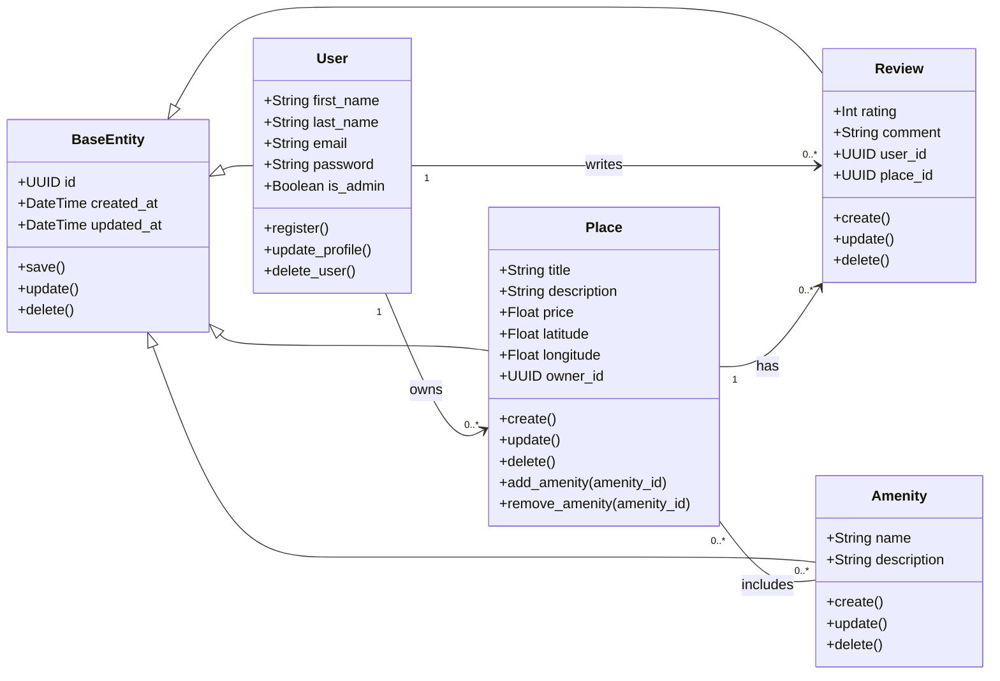

```mermaid

classDiagram
direction LR

class BaseEntity {
  +UUID id
  +DateTime created_at
  +DateTime updated_at
  +save()
  +update()
  +delete()
}

class User {
  +String first_name
  +String last_name
  +String email
  +String password
  +Boolean is_admin
  +register()
  +update_profile()
  +delete_user()
}

class Place {
  +String title
  +String description
  +Float price
  +Float latitude
  +Float longitude
  +UUID owner_id
  +create()
  +update()
  +delete()
  +add_amenity(amenity_id)
  +remove_amenity(amenity_id)
}

class Review {
  +Int rating
  +String comment
  +UUID user_id
  +UUID place_id
  +create()
  +update()
  +delete()
}

class Amenity {
  +String name
  +String description
  +create()
  +update()
  +delete()
}

%% Inheritance
BaseEntity <|-- User
BaseEntity <|-- Place
BaseEntity <|-- Review
BaseEntity <|-- Amenity

%% Relationships
User "1" --> "0..*" Place : owns
User "1" --> "0..*" Review : writes
Place "1" --> "0..*" Review : has
Place "0..*" -- "0..*" Amenity : includes


```
