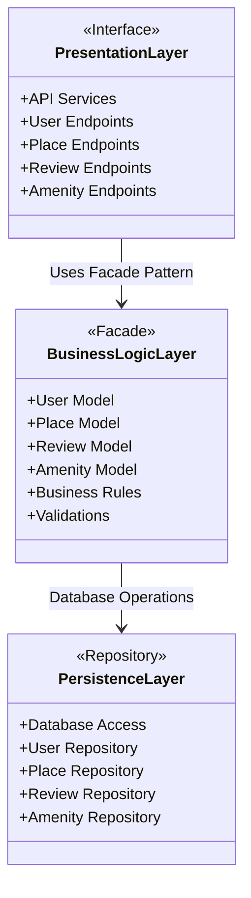

```mermaid
classDiagram
    class PresentationLayer {
        <<Interface>>
        +API Services
        +User Endpoints
        +Place Endpoints
        +Review Endpoints
        +Amenity Endpoints
    }

    class BusinessLogicLayer {
        <<Facade>>
        +User Model
        +Place Model
        +Review Model
        +Amenity Model
        +Business Rules
        +Validations
    }

    class PersistenceLayer {
        <<Repository>>
        +Database Access
        +User Repository
        +Place Repository
        +Review Repository
        +Amenity Repository
    }

    PresentationLayer --> BusinessLogicLayer : Uses Facade Pattern
    BusinessLogicLayer --> PersistenceLayer : Database Operations
```
