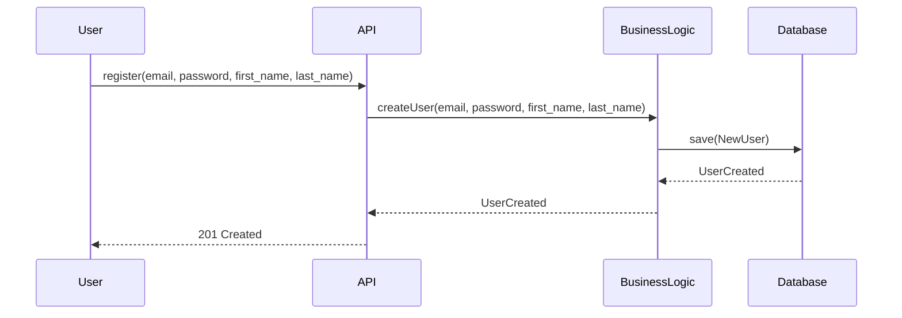

```mermaid

sequenceDiagram
participant User
participant API
participant BusinessLogic
participant Database

User->>API: register(email, password, first_name, last_name)
API->>BusinessLogic: createUser(email, password, first_name, last_name)
BusinessLogic->>Database: save(NewUser)
Database-->>BusinessLogic: UserCreated
BusinessLogic-->>API: UserCreated
API-->>User: 201 Created
```
