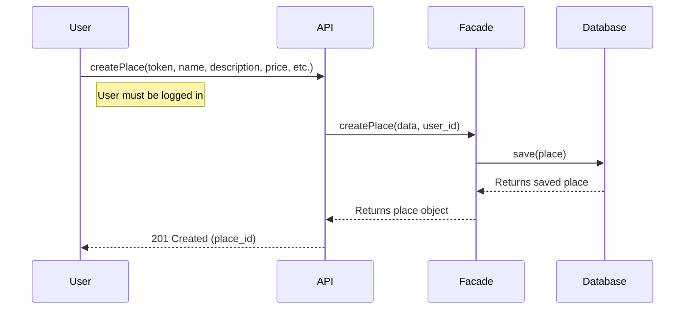

```mermaid

sequenceDiagram
    participant User
    participant API
    participant Facade
    participant Database

    User->>API: createPlace(token, name, description, price, etc.)
    Note right of User: User must be logged in
    API->>Facade: createPlace(data, user_id)
    Facade->>Database: save(place)
    Database-->>Facade: Returns saved place
    Facade-->>API: Returns place object
    API-->>User: 201 Created (place_id)
```
