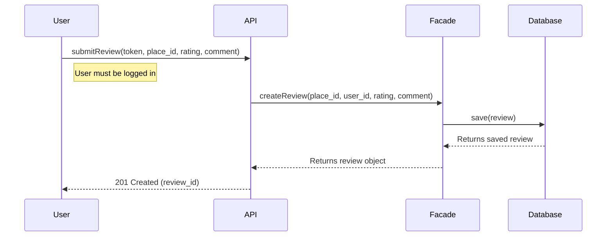

```mermaid
sequenceDiagram
    participant User
    participant API
    participant Facade
    participant Database

    User->>API: submitReview(token, place_id, rating, comment)
    Note right of User: User must be logged in
    API->>Facade: createReview(place_id, user_id, rating, comment)
    Facade->>Database: save(review)
    Database-->>Facade: Returns saved review
    Facade-->>API: Returns review object
    API-->>User: 201 Created (review_id)
```
