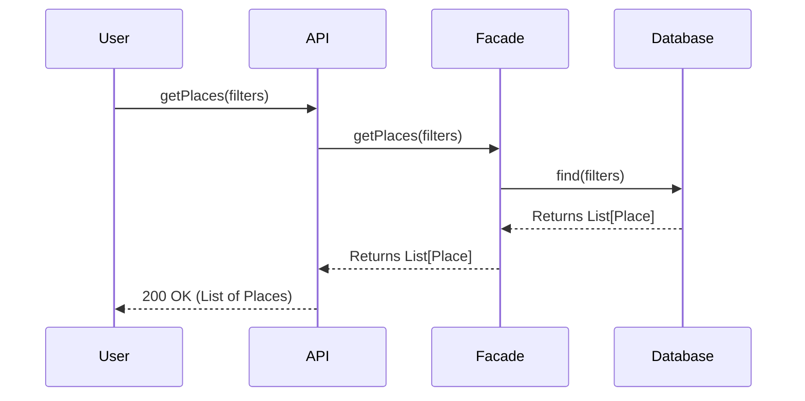

```mermaid
sequenceDiagram
    participant User
    participant API
    participant Facade
    participant Database

    User->>API: getPlaces(filters)
    API->>Facade: getPlaces(filters)
    Facade->>Database: find(filters)
    Database-->>Facade: Returns List[Place]
    Facade-->>API: Returns List[Place]
    API-->>User: 200 OK (List of Places)
```
