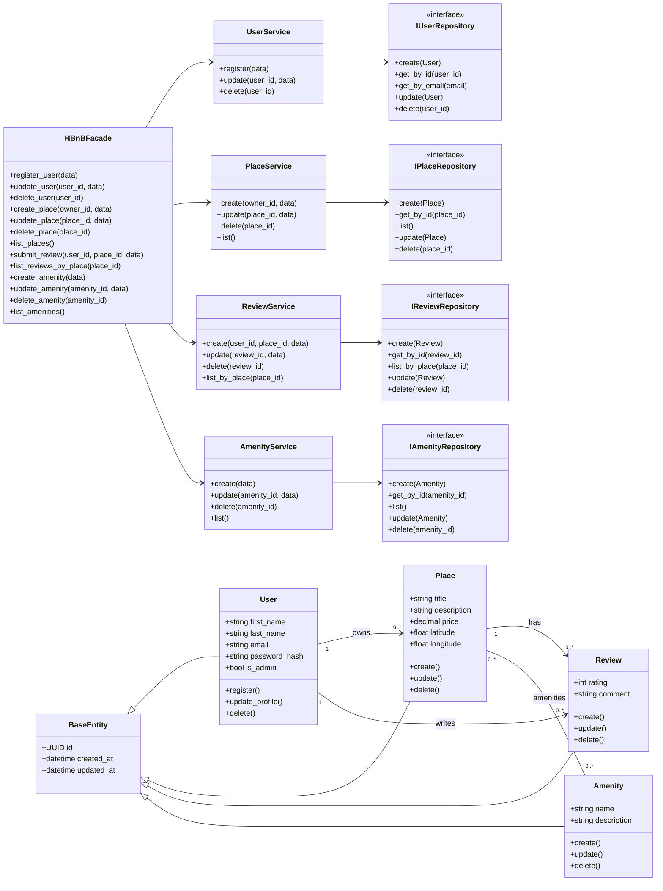
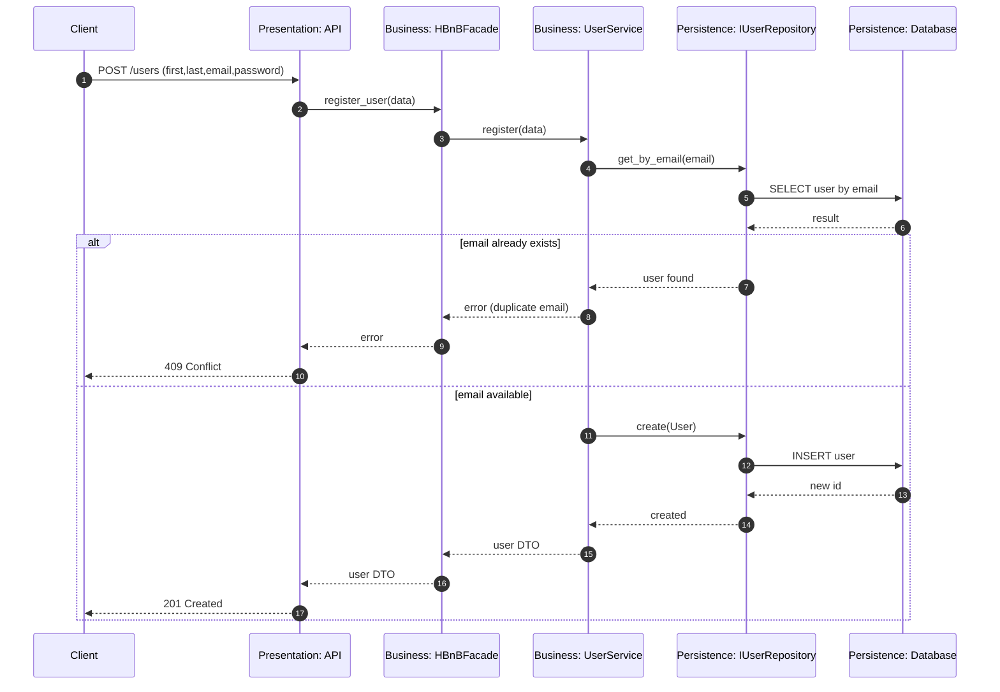
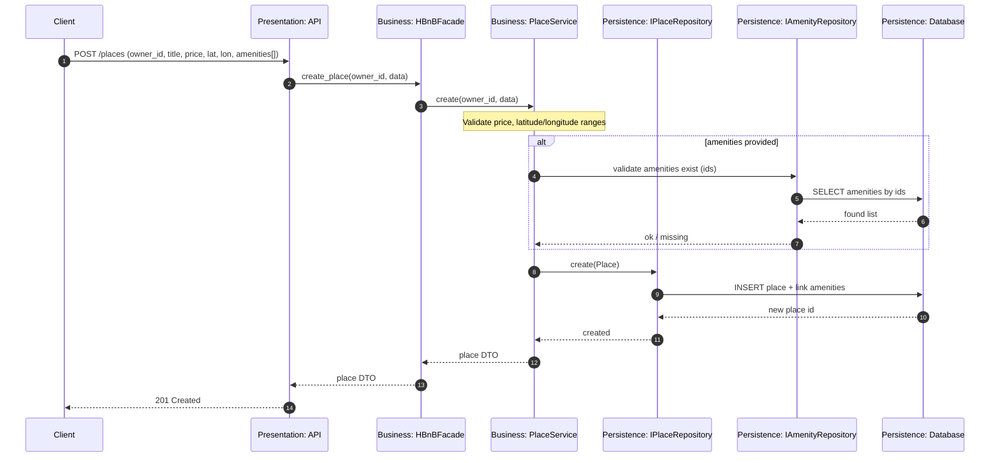
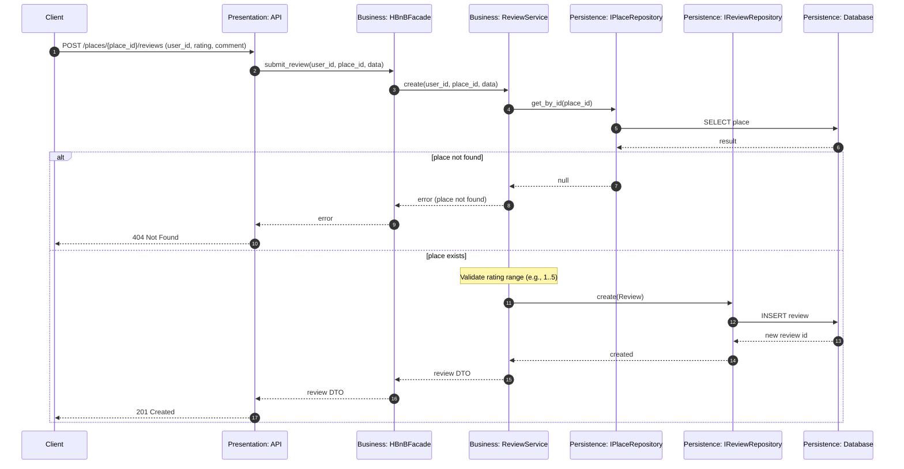
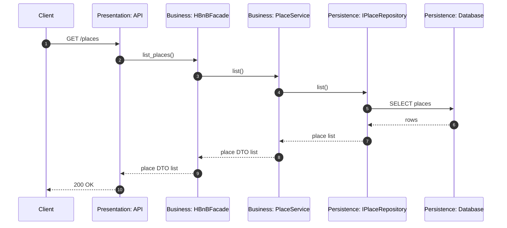

\

# HBnB Evolution — Part 1: Technical Documentation (UML)

## Team

- ABDULAZIZ ALRASHDI
- ABDULRAHMAN ALGHAMDI
- ABDULLAH ALSALEM

## Context & Objective

This document provides the technical blueprint for **HBnB Evolution**, a simplified AirBnB-like application.
The goal of Part 1 is to document the **architecture**, **business logic design**, and **layer interactions** using **UML** (via Mermaid diagrams), so implementation in later parts is straightforward.

## Scope (Simplified Product)

The system supports four primary domains:

- **User Management**: register, update profile, delete; differentiate admins.
- **Place Management**: CRUD for places; each place belongs to an owner (user) and can be linked to amenities.
- **Review Management**: CRUD reviews; reviews are created by users for places.
- **Amenity Management**: CRUD amenities; amenities can be associated with places.

## Business Rules & Requirements

### Shared / Cross-cutting

- Each object has a **unique ID**.
- For audit reasons, each entity stores **creation** and **update** timestamps.
- Persistence is required but the concrete database and its implementation are planned for **Part 3**.

### User

- Attributes: first name, last name, email, password, is_admin.
- Operations: register, update, delete.
- Email must be unique.

### Place

- Attributes: title, description, price, latitude, longitude.
- Belongs to an **owner** (User).
- Has a list of **amenities**.
- Operations: create, update, delete, list.

### Review

- Associated with a **place** and a **user**.
- Attributes: rating, comment.
- Operations: create, update, delete, list by place.

### Amenity

- Attributes: name, description.
- Operations: create, update, delete, list.

## Architecture Overview (Layered + Facade)

The application follows a **3-layer architecture**:

1. **Presentation Layer**

   - API / controllers / routes (HTTP endpoints).
   - Validates request format and authentication context.
   - Delegates to a single entry-point: a **Facade**.

2. **Business Logic Layer**

   - Domain entities (User, Place, Review, Amenity).
   - Use-cases / services that enforce business rules.
   - A **Facade** orchestrates use-cases and hides internal complexity from the API.

3. **Persistence Layer**
   - Repository interfaces and implementations.
   - Handles storage/retrieval (DB specifics deferred to Part 3).

### Why Facade?

- Provides a **stable API** for the Presentation layer.
- Centralizes orchestration and cross-cutting concerns (transactions, validation orchestration, etc.).
- Keeps controllers thin and avoids coupling the API to internal service/repository details.

---

## 1) High-Level Package Diagram (3 Layers + Facade)

```mermaid
flowchart TB
  %% High-level packages (layered) + Facade communication

  subgraph Presentation[Presentation Layer]
    API[API / Controllers]
  end

  subgraph Business[Business Logic Layer]
    FACADE[HBnBFacade]
    SVC[Use-Case Services]
    DOM[Domain Models]
  end

  subgraph Persistence[Persistence Layer]
    REPO[Repository Interfaces]
    DB[(Database<br/>(Part 3))]
  end

  API -->|calls| FACADE
  FACADE -->|orchestrates| SVC
  SVC -->|uses| DOM
  SVC -->|CRUD via| REPO
  REPO -->|persists| DB
```

---

## 2) Detailed Class Diagram (Business Logic Layer)

Notes:

- All entities inherit audit fields: `id`, `created_at`, `updated_at`.
- `Place` has a many-to-many relationship with `Amenity`.
- `Review` is associated to exactly one `User` and one `Place`.



---

## 3) Sequence Diagrams (API Calls)

Legend:

- Presentation: API / Controller
- Business: Facade + Services
- Persistence: Repositories + DB

### 3.1 User Registration



### 3.2 Place Creation



### 3.3 Review Submission



### 3.4 Fetch Places List



---

## Documentation Notes / Implementation Guidance

- **Validation** belongs primarily to the Business Logic layer (services), while the Presentation layer handles request-shape validation and authentication context.
- Audit fields (`created_at`, `updated_at`) are set/updated on create/update operations.
- Repository interfaces decouple business logic from storage technology; concrete DB work is deferred to Part 3.

## Mermaid Rendering

If diagrams do not render in your viewer, ensure Mermaid support is enabled in Markdown preview (VS Code Mermaid extensions may help), or paste the Mermaid blocks into https://mermaid.live.
